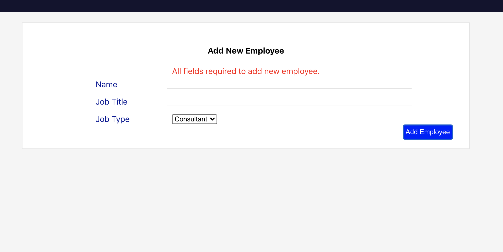
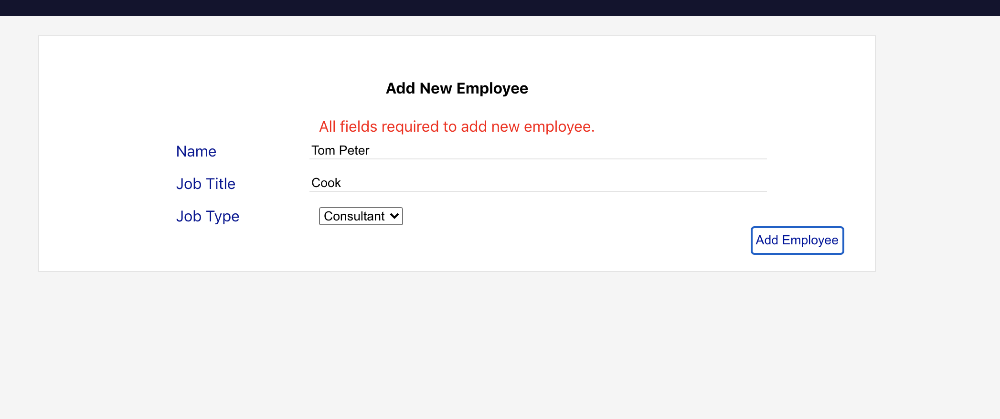
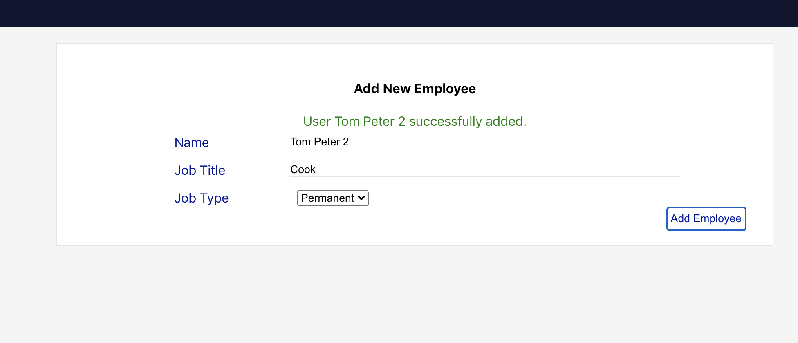

### Simple Hr EMployee Management Solution

#### Prerequsites

    Please Note that to run this app you need to have a postgres server running locally. Please update the db user and any other details in the connection string `StartUp.cs`

    - This application does the following
    > List all employees
    > Add employees

#### Setting up project locally
1. clone repo

    `git clone <>`

2. Cd into project

    `cd <>`

3. Install `ClientApp` dependencies

    `cd <>`
    
    `npm install`

    `cd ..`

4. Install Server dependencies

    
    > dotnet add package NpgSql.EntityFrameworkCore.PostgreSQL.Design
    > dotnet add package NpgSql.EntityFrameworkCore.PostgreSQL
    > dotnet add package Microsoft.EntityFrameworkCore.Design --version 3.1.4
    > dotnet add package Microsoft.AspNetCore.Identity.EntityFrameworkCore

5. Upgrade db

    `dotnet ef database update`

6. Run app

    `dotnet run`

7. Checkout app at `http://localhost:5001/`

#### Screenshots
1. 
2. 
3. 
4. 
5. 
6. 
7. 
